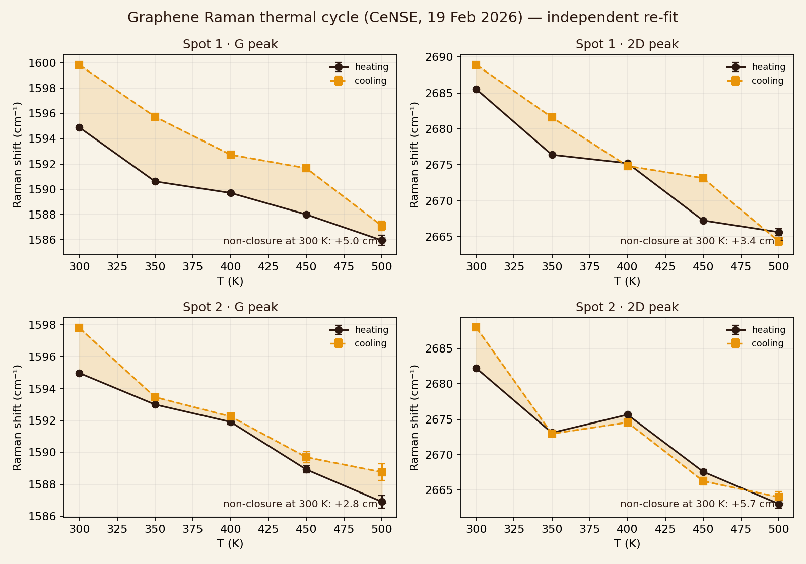

# T02 — Graphene Raman thermal-cycle hysteresis (CeNSE IISc, 19 Feb 2026)

Raw LabSpec exports: `data/raman_graphene_cense_20260219/` (24 spectra, manifest-hashed).
Script: `scripts/run_t02_raman_hysteresis.py` · Certificate: `results/T02_RAMAN_HYSTERESIS.json` (pin in `.sha256`).

| Spot | Band | Loop area (cm⁻¹·K) | σ | Paper Table V | Closure gap at 300 K |
|---|---|---|---|---|---|
| 1 | G  | 744.0 ± 22.2 | 34 | 749.7 ± 24.9 | +4.95 cm⁻¹ (52σ) |
| 1 | 2D | 691.9 ± 28.4 | 24 | 711.1 ± 34.2 | +3.40 (26σ) |
| 2 | G  | 195.8 ± 30.6 | 6  | 189.0 ± 31.5 | +2.83 (30σ) |
| 2 | 2D | 294.9 ± 46.2 | 6  | 295.1 ± 55.7 | +5.73 (43σ) |

**Classification:** `FIRST_CYCLE_HYSTERESIS_WITH_NONCLOSURE`.
First-cycle hysteresis is real and reproduces the paper; the loop does not close at 300 K (G upshift after the 500 K excursion), consistent with an irreversible component (doping / adsorbate desorption / strain release on SiO₂ in ambient). Reversible thermodynamic curvature is therefore **not established** by this dataset.

**Predeclared cycle-2 rule** (fixed before any second-cycle data): reopen ratio r = A₂/A₁ on the same spot and band. r ≥ 0.6 on both G and 2D → `CURVATURE_SUPPORTED_PENDING_SUBSTRATE_CONTROL`; r ≤ 0.2 on both → `IRREVERSIBLE_DRIFT_DOMINANT`; otherwise `INDETERMINATE` (more cycles / ramp-rate sweep / hBN control).

Follow-up session required: 2–3 cycles same spot, two ramp rates, hBN-encapsulated or suspended control, full timestamp log.
